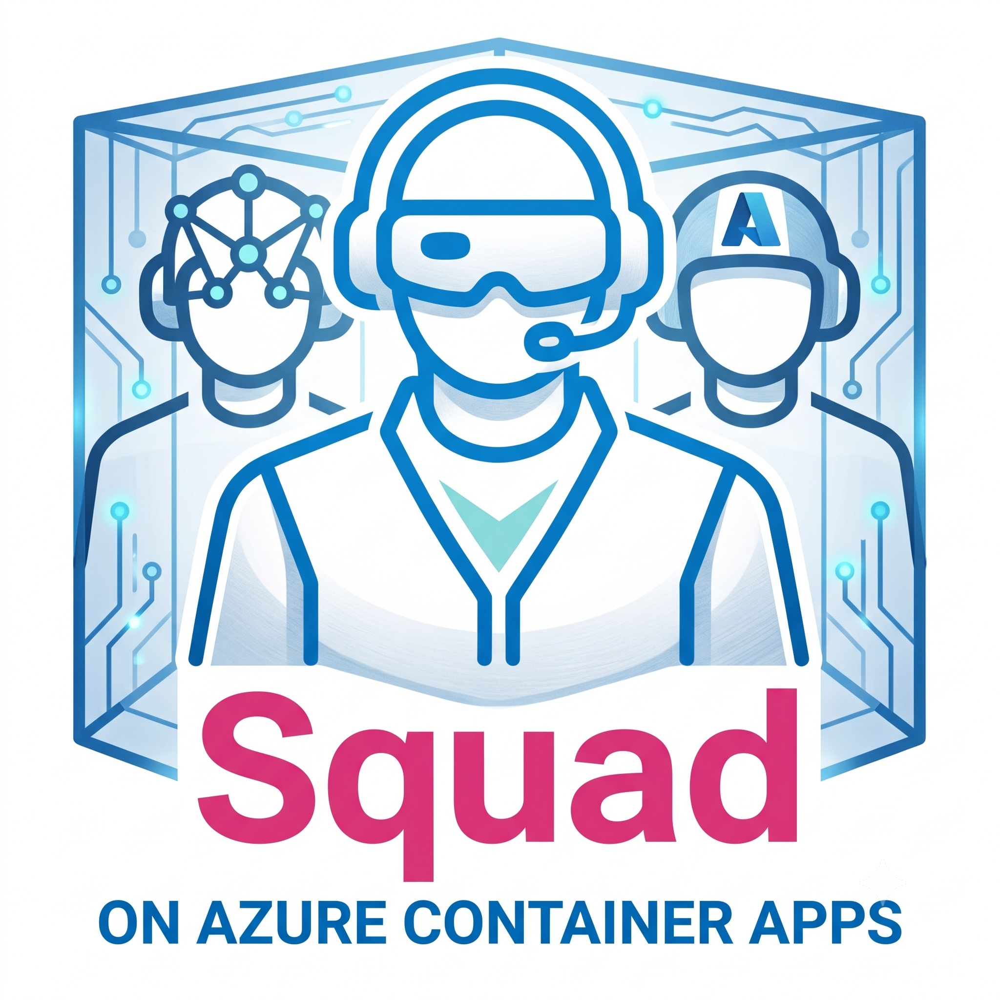

# Squad on Azure Container Apps

<p align="center">
  
</p>

Run Brady Gaster's Squad on Azure Container Apps (ACA): one isolated ACA job execution per Squad session, GitHub-hosted code and state, GitHub remote session access, and centralized Aspire telemetry.

## What you get

| Capability | ACA implementation |
| --- | --- |
| One Squad team per remote session | Manual ACA job execution (`caj-squad-aca-session`) |
| Ralph scheduler | Scheduled ACA job (`caj-squad-aca-ralph`) polls every 5 minutes and starts ACA session jobs |
| Pod/container mode | `SQUAD_DEPLOYMENT_MODE=squad-per-pod` and `SQUAD_POD_ID=<session>` by default |
| GitHub `/remote` session access | Copilot CLI runs with `--remote` by default |
| GitHub-backed code | Each session clones `owner/repo`, works in an isolated workspace, and can push a branch/PR |
| Monitoring | Aspire Dashboard on ACA with OTLP API-key auth and browser-token UI auth |
| Unattended work | ACA watcher app running `squad watch --execute` |
| Secure image pulls | ACR plus user-assigned managed identity |
| Token storage | ACA secrets by default; optional Key Vault references with `-UseKeyVault` |
| CI/CD | GitHub Actions workflow with Azure OIDC login |

## Quick start

```powershell
.\scripts\deploy.ps1 -SubscriptionId "<azure-subscription-id>" -DefaultRepository "<github-owner>/<repo>"
.\scripts\squad-aca.ps1 install-command
```

Open a new terminal after `install-command`, then from any repo:

```powershell
squad-aca init --owner "<github-owner>" --name "my-app"
squad-aca "Build the first feature and open a PR"
```

Or use GitHub Copilot:

```powershell
copilot --agent squad-aca
```

The local Copilot session becomes the control plane. The actual Squad team runs in ACA.

Useful control-plane commands:

```powershell
squad-aca doctor            # validate local repo, GitHub, Azure, ACA, and Aspire config
squad-aca sessions          # list recent ACA-hosted Squad sessions
squad-aca logs <session>    # stream logs for a session name or execution id
squad-aca open <session>    # open the session PR when available, otherwise Aspire
squad-aca sync              # push local .squad state before dispatch
```

## Existing Squad repo flow

If you already have a repo with `.squad/` initialized:

```powershell
cd path\to\existing-squad-repo
squad-aca "Use the existing Squad team to implement the next feature and open a PR"
```

Before dispatching, `squad-aca`:

1. Verifies the ACA session job exists.
2. Verifies `.squad/team.md` exists locally.
3. Commits and pushes `.squad` state plus the `squad-aca` agent file if needed.
4. Starts `caj-squad-aca-session` against the current GitHub repo and branch.

If ACA has not been deployed or configured, it stops with a deploy/configure message instead of failing later in Azure.

To point the command at an existing ACA deployment:

```powershell
squad-aca configure --resource-group <rg> --session-job <job> --subscription <azure-subscription-id>
```

To include all local working-tree changes, not just Squad state, add `--sync-all`.

## Direct script quick start

If you do not want to install the `squad-aca` command:

```powershell
.\scripts\start-session.ps1 -Repository "<github-owner>/<repo>" -Mode smoke -RunCopilotSmoke -SessionName smoke-001
.\scripts\show-status.ps1
```

Open the Aspire login URL from `deploy.outputs.json` to see traces and logs grouped by `squad-<session-name>`.

## Scale-to-zero model

Squad on ACA is job-first, so most compute is zero when idle:

| Component | Scales to zero? | Notes |
| --- | --- | --- |
| Session jobs (`caj-squad-aca-session`) | Yes | A job execution starts for a Squad session, then exits. No idle replica remains. |
| Ralph (`caj-squad-aca-ralph`) | Yes between runs | A scheduled job wakes every 5 minutes, dispatches work, then exits. |
| Watcher (`ca-squad-aca-watch`) | Yes when stopped | The optional watcher app is configured for 0/1 replicas. |
| Aspire (`ca-squad-aca-aspire`) | No, by default | Kept at 1 replica so the dashboard is always available. Set it to 0 only if you are comfortable restarting it before viewing telemetry. |

ACA does not need KEDA for per-session scale-to-zero. ACA Jobs already provide the same cost shape as Kubernetes Jobs: no execution, no running agent pod.

## Run a Squad session

Simple command:

```powershell
squad-aca "Use Squad to implement issue #123. Create a branch and PR."
```

Explicit script command:

```powershell
.\scripts\start-session.ps1 `
  -Repository "<github-owner>/<repo>" `
  -Mode prompt `
  -SessionName feature-123 `
  -Prompt "Use Squad to implement issue #123. Create a branch and PR." `
  -PushChanges `
  -OutputBranch squad/feature-123
```

Each execution schedules a new ACA job replica, sets `SQUAD_POD_ID=feature-123`, enables GitHub remote control, and exports telemetry to Aspire.

## Start without an existing repo

Use the new-project helper. It creates a GitHub repo with an initial default branch, then starts a remote Squad bootstrap session:

```powershell
squad-aca new --owner "<github-owner>" --name my-new-squad-project --description "A new app bootstrapped by Squad on ACA"
```

Direct script form:

```powershell
.\scripts\new-project.ps1 `
  -Owner "<github-owner>" `
  -Name my-new-squad-project `
  -Description "A new app bootstrapped by Squad on ACA"
```

The helper starts `SQUAD_MODE=new-project`, which initializes Squad state in the ACA session and opens a bootstrap PR from a `squad/bootstrap-*` branch.

## Ralph versus worker image

The worker image contains Node.js, Azure CLI, GitHub CLI, Copilot CLI, and Squad CLI. Ralph is not the image; Ralph is a scheduled job mode in that image. `caj-squad-aca-ralph` runs `SQUAD_MODE=ralph` every 5 minutes, polls GitHub issues, marks actionable issues as dispatched, and starts new `caj-squad-aca-session` executions as the agent pods.

## Run a watcher

```powershell
squad-aca status
.\scripts\start-watch.ps1 -Repository "<github-owner>/<repo>" -IntervalMinutes 5
```

Label work with `squad` or `squad:*`. For SubSquads, commit `.squad/streams.json` and pass `-SubSquad docs` or another stream name.

## Production secrets

Use Key Vault-backed Container Apps secrets:

```powershell
.\scripts\deploy.ps1 -UseKeyVault -KeyVaultName kv-your-squad-aca
```

See [docs/runbook.md](docs/runbook.md) and [docs/feature-parity.md](docs/feature-parity.md).
