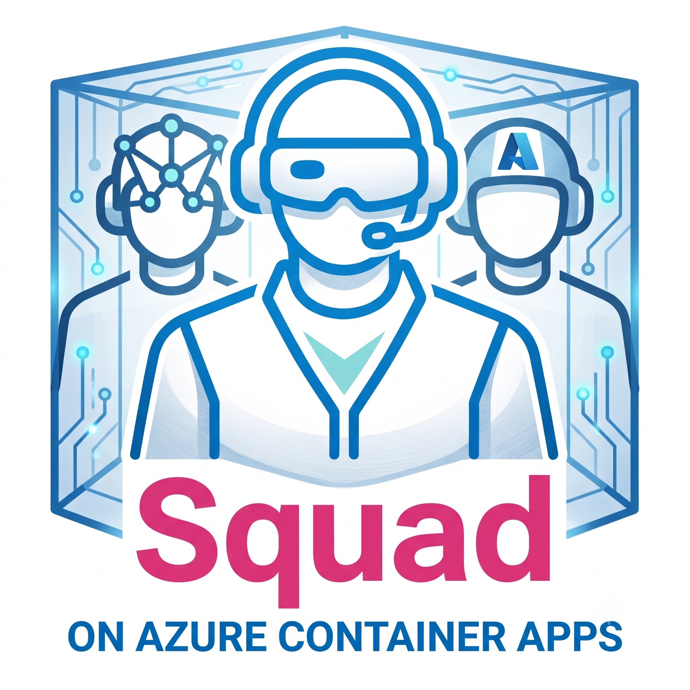

# Squad on Azure Container Apps

<p align="center">
  
</p>

Run Brady Gaster's Squad on Azure Container Apps (ACA): one isolated ACA job execution per Squad session, GitHub-hosted code and state, GitHub remote session access, and centralized Aspire telemetry.

## What you get

| Capability | ACA implementation |
| --- | --- |
| One Squad team per remote session | Manual ACA job execution (`caj-squad-aca-session`) |
| Ralph scheduler | Scheduled ACA job (`caj-squad-aca-ralph`) polls every 5 minutes and starts ACA session jobs |
| Pod/container mode | `SQUAD_DEPLOYMENT_MODE=squad-per-pod` and `SQUAD_POD_ID=<session>` by default |
| GitHub `/remote` session access | Copilot CLI runs with `--remote` by default |
| GitHub-backed code | Each session clones `owner/repo`, works in an isolated workspace, and can push a branch/PR |
| Monitoring | Standalone Aspire Dashboard on ACA as the default OTLP sink, with OTLP API-key auth and browser-token UI auth |
| Unattended work | ACA watcher app running `squad watch --execute` |
| Secure image pulls | ACR plus user-assigned managed identity |
| Token storage | ACA secrets by default; optional Key Vault references with `-UseKeyVault` |
| Second execution plane (opt-in preview) | ACA Sandboxes behind `SQUAD_ACA_ENABLE_SANDBOX`, for per-session isolation and default-deny egress. Off by default; ACA Jobs stay the default and rollback path |
| Agent tool policy | Every session resolves an `attended` or `autonomous` tier before any agent starts; unattended runs do not receive destructive infrastructure verbs. `--yolo` is never emitted |
| Governance-path protection | `.squad/` policy, identity, and audit state is made read-only and hash-verified for the session; a violation fails the run and pushes nothing |
| Event-driven trigger | A GitHub Actions workflow (`squad-dispatch.yml`) fires on an issue label or a `/squad-aca` comment, federates to Azure by OIDC, and starts the ACA session job. Actions is the trigger transport; the decision, lease, and run stay in Azure |
| Duplicate-dispatch protection | A durable lease is claimed before compute is requested, shared by the CLI, Ralph, the watcher, and the Actions trigger (`squad-aca leases`) |
| Callable as an agent (opt-in) | Exposed as a Microsoft Agent Framework `AIAgent` (`Microsoft.Agents.AI` 1.16.0) in `aspire/Squad.Aca.Agents.MAF`, over a framework-free `ISquadAgent` contract |
| CI/CD | GitHub Actions workflow with Azure OIDC login |

## Quick start

```powershell
.\scripts\deploy.ps1 -SubscriptionId "<azure-subscription-id>" -DefaultRepository "<github-owner>/<repo>"
.\scripts\squad-aca.ps1 install-command
```

Open a new terminal after `install-command`, then run from any repository:

```powershell
squad-aca init --owner "<github-owner>" --name "my-app"
squad-aca "Build the first feature and open a PR"
```

Or use GitHub Copilot as the local control plane:

```powershell
copilot --agent squad-aca
```

The Squad team runs in ACA.

## Assumptions and prerequisites

- **Azure**: an Azure subscription and `az` CLI signed in (`az login`), with rights to create resource groups, ACR, Container Apps, managed identities, role assignments, Log Analytics, and optional Key Vault.
- **GitHub**: `gh` CLI authenticated (`gh auth login`) and `gh auth setup-git` configured, plus a token valid for Copilot CLI headless auth. Use a separate `COPILOT_GITHUB_TOKEN` when your policy requires token separation.
- **Local tooling**: PowerShell 5.1+ or PowerShell 7, Git, and Node.js/npm for the Squad and Copilot CLIs. `bash` is needed only for the worker entrypoint syntax check in `scripts/validate.ps1`.
- **Telemetry**: the default OTLP sink is a standalone Aspire Dashboard running as a Container App. It uses browser-token UI auth and OTLP API-key auth. OTLP ports are internal to the ACA environment.
- **Optional .NET/Aspire path**: the `aspire/` projects require the .NET SDK 9.0+ and a .NET 9 runtime. They are opt-in and not needed for the default ACA flow. See [aspire/README.md](aspire/README.md).

Deployment writes secrets and tokens to the local, gitignored `deploy.outputs.json`. Keep it private and never commit it.

Useful control-plane commands:

```powershell
squad-aca doctor            # validate local repo, GitHub, Azure, ACA, and Aspire config
squad-aca sessions          # list recent ACA-hosted Squad sessions
squad-aca logs <session>    # stream logs for a session name or execution id
squad-aca stop <session>    # stop a running ACA session
squad-aca open <session>    # open the session PR when available, otherwise Aspire
squad-aca sync              # push local .squad state before dispatch
squad-aca watch status      # inspect optional watcher app
squad-aca ralph status      # inspect scheduled Ralph dispatcher
squad-aca subsquad list     # list configured SubSquads
squad-aca telemetry smoke   # emit known-good logs/traces/metrics to Aspire
```

## Existing Squad repo flow

If you already have a repo with `.squad/` initialized:

```powershell
cd path\to\existing-squad-repo
squad-aca "Use the existing Squad team to implement the next feature and open a PR"
```

Before dispatching, `squad-aca`:

1. Verifies the ACA session job exists.
2. Verifies `.squad/team.md` exists locally.
3. Commits and pushes `.squad` state plus the `squad-aca` agent file if needed.
4. Starts `caj-squad-aca-session` against the current GitHub repo and branch.

If ACA has not been deployed or configured, it stops with a deploy/configure message.

To point the command at an existing ACA deployment:

```powershell
squad-aca configure --resource-group <rg> --session-job <job> --subscription <azure-subscription-id>
```

To include all local working-tree changes, not just Squad state, add `--sync-all`.

## Direct script quick start

```powershell
.\scripts\start-session.ps1 -Repository "<github-owner>/<repo>" -Mode smoke -RunCopilotSmoke -SessionName smoke-001
.\scripts\show-status.ps1
```

Open the Aspire login URL from `deploy.outputs.json` to see traces and logs grouped by `squad-<session-name>`.

## Scale-to-zero model

| Component | Scales to zero? | Notes |
| --- | --- | --- |
| Session jobs (`caj-squad-aca-session`) | Yes | A job execution starts for a Squad session, then exits. No idle replica remains. |
| Ralph (`caj-squad-aca-ralph`) | Yes between runs | A scheduled job wakes every 5 minutes, dispatches work, then exits. |
| Watcher (`ca-squad-aca-watch`) | Yes when stopped | The optional watcher app is configured for 0/1 replicas. |
| Aspire (`ca-squad-aca-aspire`) | No, by default | Kept at 1 replica so the dashboard is available. Set it to 0 only when you will restart it before viewing telemetry. |

ACA Jobs provide per-session scale-to-zero without KEDA.

## Run a Squad session

```powershell
squad-aca "Use Squad to implement issue #123. Create a branch and PR."
```

Explicit script command:

```powershell
.\scripts\start-session.ps1 `
  -Repository "<github-owner>/<repo>" `
  -Mode prompt `
  -SessionName feature-123 `
  -Prompt "Use Squad to implement issue #123. Create a branch and PR." `
  -PushChanges `
  -OutputBranch squad/feature-123
```

Each execution schedules a new ACA job replica, sets `SQUAD_POD_ID=feature-123`, enables GitHub remote control, and exports telemetry to Aspire.

## Start without an existing repo

Use the new-project helper. It creates a GitHub repo with an initial default branch, then starts a remote Squad bootstrap session:

```powershell
squad-aca new --owner "<github-owner>" --name my-new-squad-project --description "A new app bootstrapped by Squad on ACA"
```

Direct script form:

```powershell
.\scripts\new-project.ps1 `
  -Owner "<github-owner>" `
  -Name my-new-squad-project `
  -Description "A new app bootstrapped by Squad on ACA"
```

The helper starts `SQUAD_MODE=new-project`, initializes Squad state in the ACA session, and opens a bootstrap PR from a `squad/bootstrap-*` branch.

## Ralph and watcher

The worker image contains Node.js, Azure CLI, GitHub CLI, Copilot CLI, and Squad CLI. Ralph is a scheduled job mode in that image. `caj-squad-aca-ralph` runs `SQUAD_MODE=ralph` every 5 minutes, polls GitHub issues, marks actionable issues as dispatched, and starts new `caj-squad-aca-session` executions.

Run a watcher:

```powershell
squad-aca status
.\scripts\start-watch.ps1 -Repository "<github-owner>/<repo>" -IntervalMinutes 5
```

Label work with **`squad-aca`**. For SubSquads, commit `.squad/streams.json` and pass `-SubSquad docs` or another stream name.

## Production secrets

Use Key Vault-backed Container Apps secrets:

```powershell
.\scripts\deploy.ps1 -UseKeyVault -KeyVaultName kv-your-squad-aca
```

## Optional .NET / Aspire integration path

`squad-aca` stays a thin ACA remote-runner and control plane. The repo also includes an optional .NET/Aspire path under [`aspire/`](aspire/):

- **Aspire** models resources as code.
- **Agent Framework** exposes the Squad session as an `AIAgent` through `Squad.Aca.Agents.MAF`.
- **ACA** remains the production execution substrate.
- **Squad** remains the orchestration system.

```powershell
cd aspire
dotnet build .\Squad.Aca.sln
cd Squad.Aca.AppHost
dotnet run   # brings up the Aspire Dashboard OTLP sink locally
```

See [aspire/README.md](aspire/README.md), [docs/architecture.md](docs/architecture.md), and [docs/maf-adapter.md](docs/maf-adapter.md).

## Validation

Run the static validation gate before pushing:

```powershell
.\scripts\validate.ps1            # offline checks plus dotnet build/test when an SDK is present
.\scripts\validate.ps1 -RunDotnet # make a missing dotnet SDK a failure, not a skip
```

Run the worker suite when `bash` and `node` are available:

```bash
bash worker/tests/run-tests.sh
node --check worker/lib/parse-capabilities.js
```

The same suite runs in CI via [`.github/workflows/worker-tests.yml`](.github/workflows/worker-tests.yml). See [docs/validation.md](docs/validation.md).

## Capability-aware execution

Repositories can commit a `squad-capabilities.yml` manifest declaring the tools, credentials, services, and egress a session needs. A preflight step runs after clone and before Squad/Copilot starts. Required tools and credentials fail fast when absent. See [docs/capability-manifest.md](docs/capability-manifest.md).

The manifest also produces a deterministic routing decision: run on the default ACA job, run on an approved sandbox class, or fail closed.

## ACA Sandboxes

Azure Container Apps Sandboxes are an opt-in second execution plane that gives a session per-session isolation and default-deny egress. ACA Jobs remain the default and rollback path. The plane is off unless you enable it for a specific invocation.

Quickstart:

1. Install the standalone `aca` CLI. Sandboxes are not driven by `az`; there is no `az containerapp sandbox` command.
2. Create an identity-free sandbox group and a disk built from the pinned image of the approved class your repository will select. See [docs/runbook.md](docs/runbook.md#aca-sandboxes-preview-feature-flagged-off) for commands.
3. Add `sandboxGroup` and `sandboxDiskId` to `~/.squad-on-aca/config.json`.
4. Commit a `squad-capabilities.yml` to the repository.
5. Enable the flag and dispatch from that repository's working tree:

```powershell
$env:SQUAD_ACA_ENABLE_SANDBOX = "1"     # accepted: 1 / true / yes / on / enabled
squad-aca run "<prompt>"
```

With the flag off, a repository that needs a non-default capability is refused instead of running on the default worker. See [docs/sandboxes.md](docs/sandboxes.md).

## Triggering from a GitHub event

Label an issue **`squad-aca`**, or comment **`/squad-aca <instruction>`**, and the work runs in Azure:

```text
label an issue  ->  GitHub Actions  ->  OIDC  ->  Azure Container Apps  ->  agent  ->  branch  ->  pull request
```

| Stage | Runs on |
|---|---|
| Decide whether the event is a trigger | GitHub Actions runner |
| Federate to Azure, claim the shared lease, start the job | GitHub Actions runner |
| Route, run the agent, push the branch, open the PR | Azure Container Apps |

The workflow comments the execution name back on the issue. It does not wait for the session or poll it. See [docs/actions-trigger.md](docs/actions-trigger.md).

### Who can trigger it

Only people with access to **this repository**:

| Route | Who |
|---|---|
| Apply the `squad-aca` label | Collaborators with Triage or above |
| Comment the command | Owner, organisation member, or collaborator |
| Run the workflow manually | Collaborators with Write or above |

**To let somebody run it, add them in Settings → Collaborators and teams.** Any
role works, including Read. Removing them revokes it immediately.

`CONTRIBUTOR` is not a permission and is not accepted — GitHub reports it for
anyone who has ever had a commit merged, and on a public repository that is
anybody who once landed a pull request.

## Agent integration (Microsoft Agent Framework)

Squad on ACA is callable as an agent. `aspire/Squad.Aca.Agents.MAF` exposes the control plane as a Microsoft Agent Framework `AIAgent`.

```csharp
services.AddSingleton<ISquadAgent>(sp => new AcaSquadAgent(/* ... */));
services.AddSquadAcaAgent(o => o.DefaultRepository = "<github-owner>/<repo>");

AIAgent agent = provider.GetRequiredService<AIAgent>();
AgentResponse response = await agent.RunAsync("Fix the flaky test and open a PR.");
```

Runnable sample:

```powershell
dotnet run --project aspire/Squad.Aca.Agents.MAF.Sample -- `
  "Fix the flaky test and open a PR." --repo "<github-owner>/<repo>" --no-push
```

`RunAsync` waits for the session to finish by default. Fire-and-forget is opt-in. See [docs/maf-adapter.md](docs/maf-adapter.md) and [docs/agent-contract.md](docs/agent-contract.md).

## Operational safeguards

- Use a separate GitHub token for GitHub API work and Copilot headless auth when your policy requires separation.
- Use `-UseKeyVault` for Key Vault-backed Container Apps secrets.
- Keep `deploy.outputs.json` private; it contains deployment outputs and tokens. It is gitignored.
- Use `squad-aca sync --sync-all` only after checking the public-repo guard output. Override only for known-private repos with `SQUAD_ACA_ALLOW_UNSAFE_SYNC=1`.
- Run `scripts/validate.ps1` before pushing.

## Documentation

| If you want to | Read |
|---|---|
| Deploy it and run a session | [docs/runbook.md](docs/runbook.md) |
| Trigger sessions from GitHub issues | [docs/actions-trigger.md](docs/actions-trigger.md) |
| Declare what your repository needs | [docs/capability-manifest.md](docs/capability-manifest.md) |
| Use the second execution plane | [docs/sandboxes.md](docs/sandboxes.md) |
| Let a human approve tool calls remotely | [docs/squad-hub.md](docs/squad-hub.md) |
| Call Squad on ACA from your own code | [docs/maf-adapter.md](docs/maf-adapter.md) and [docs/agent-contract.md](docs/agent-contract.md) |
| Understand how it fits together | [docs/architecture.md](docs/architecture.md) |
| Turn something off | [docs/rollback.md](docs/rollback.md) |
| Verify a change | [docs/validation.md](docs/validation.md) |
