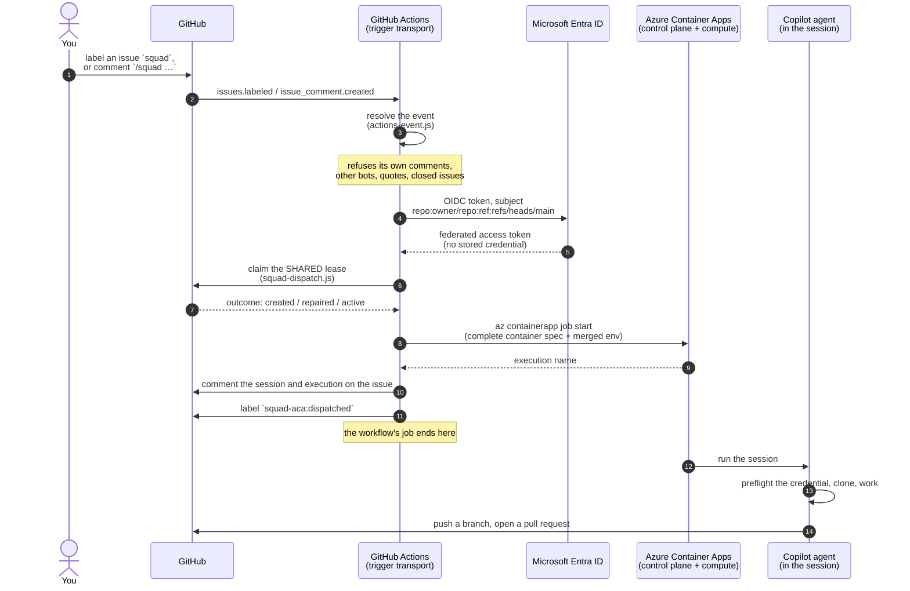

# Triggering a session from a GitHub event

Squad on ACA can start a session from a GitHub event instead of from a
developer's laptop. A GitHub Actions workflow fires, authenticates to Azure by
OIDC, and starts the ACA session job.

**Actions is the trigger transport and nothing else.** Every decision — whether
to run, what to run, and whether someone is already running it — is made by the
shared dispatch core in `worker/lib/`, the same code the local CLI, Ralph and
Watch use. The control plane stays in Azure.

## The whole path, end to end



Steps 1 to 11 take about a minute. Everything after step 12 happens in Azure
with no laptop, no browser session, and no GitHub Actions minutes.

### What runs where

| Stage | Runs on | Holds |
|---|---|---|
| Deciding whether the event is a trigger | GitHub Actions runner | the event payload only |
| Federating to Azure | GitHub Actions runner | a **short-lived** OIDC token; no stored Azure credential |
| Claiming the lease | GitHub Actions runner | `GITHUB_TOKEN`, scoped to this repository |
| **Deciding the route, running the agent, pushing** | **Azure Container Apps** | the session's own credential, delivered as an ACA secret |

The workflow's last act is to start a job. It does **not** wait for the session,
poll it, or hold its credential. If the runner vanished the moment after step 9,
the session would still finish and still open its pull request.

### Proof that this is real

`docs/e2e-results.md` records five live runs of this exact path, including the
three that failed and why. The final one — ACA execution
`caj-squad-aca-session-nwxyb1h` — wrote that evidence file and opened its own
pull request from inside Azure.

## How to trigger one

| Trigger | What happens |
|---|---|
| Apply the **`squad`** label to an open issue | A session is dispatched to work that issue |
| Comment **`/squad <instruction>`** on an open issue | A session is dispatched with your instruction as the prompt |
| Comment **`@squad-on-aca-control-plane <instruction>`** | The same, using an @mention |
| Comment **`/squad`** with no text | A session is dispatched with a default prompt |
| Run the workflow manually | `workflow_dispatch`, with optional issue and prompt inputs |

The label and the command prefix are configurable through repository variables
`SQUAD_TRIGGER_LABEL` and `SQUAD_COMMAND_PREFIX`.

## What you see back

The trigger comments on the issue with the session name, the ACA execution name,
and a link to the workflow run. Without it a requester sees a label change and
then silence for up to an hour, with no way to distinguish a running session
from a trigger that quietly refused.

Commits carry a `Co-authored-by:` trailer naming whoever asked. That matters
because of an empirical finding: **GitHub attributes a commit entirely by the
author email and not at all by the token used to push it.** A commit pushed with
an App installation token but authored as anything else shows as *unlinked* —
no avatar, no user. See "Attribution" below.

## What will *not* trigger a session

These are refusals, not bugs. Each one has a named reason that appears in the
workflow log, and each is covered by `worker/tests/test_actions_event.sh`.

| Situation | Reason |
|---|---|
| The App itself comments or labels | `actor-is-this-app` |
| Any other bot issues the command | `actor-is-a-bot` |
| The command appears in a **quoted** reply (`> /squad ...`) | `comment-carries-no-command` |
| The App is **@mentioned mid-sentence** (`I think @squad-... could help`) | `comment-carries-no-command` |
| The command appears mid-sentence | `comment-carries-no-command` |
| A comment is **edited** to contain the command | `action-not-a-trigger` |
| The issue is closed | `issue-is-closed` |
| A different label is applied | `label-not-the-trigger-label` |
| An issue is merely opened | `action-not-a-trigger` — the label is the consent |

### Why the loop break exists

Events caused by the built-in `GITHUB_TOKEN` **do not** start new workflow runs,
so Actions cannot retrigger itself. A **GitHub App** token has no such
protection. A session that comments on an issue using an App credential *would*
retrigger this workflow, start another session, comment again, and continue —
an unbounded loop that bills by the minute.

The `actor-is-this-app` refusal is what makes the App path safe, and it is
checked before any other branch so nothing downstream can reach a dispatch.

## Attribution

Measured against a real GitHub App push, because it is not documented:

| Commit author email | GitHub attribution |
|---|---|
| `squad-on-aca@users.noreply.github.com` | **`null` — unlinked** |
| `<APP_ID>+<slug>[bot]@users.noreply.github.com` | **`null` — unlinked** |
| `<BOT_USER_ID>+<slug>[bot]@users.noreply.github.com` | `squad-on-aca-control-plane[bot]` (Bot) |

Two findings worth keeping:

1. **The push token does not determine authorship at all.** All three commits
   above were pushed with the same App installation token. Attribution comes
   purely from the commit's author email.
2. **The App ID is not the bot user ID.** They are different numbers, and using
   the App ID — the intuitive choice — produces a silently *unlinked* commit. It
   looks fine until you notice there is no avatar. The bot user ID comes from
   `GET /users/<slug>[bot]`.

Sessions therefore keep a machine author — the work *is* machine-authored — and
credit the requester with a `Co-authored-by:` trailer, which links correctly and
does not misrepresent who wrote the code.
## Why Actions rather than a webhook

A webhook receiver would need public ingress, an always-on replica, and a stored
credential. GitHub requires a `2xx` **within 10 seconds** and does **not**
automatically redeliver failed deliveries, which collides directly with
scale-to-zero.

On this path there is **no public ingress, no always-on replica, and no stored
Azure credential** — the only Azure credential is a federated token minted per
run.

## Duplicate dispatch

Ralph polls every five minutes and the Actions trigger fires immediately, so
both can see the same issue. Two mechanisms keep that from producing two
sessions, and they cover different windows:

| Window | Mechanism |
|---|---|
| **Concurrent** — both dispatchers act at once | The **shared lease**. The workflow runs `squad-dispatch.js decide --dispatch-source actions` and claims the lease before requesting compute. Losing the race stands the trigger down, which the log reports as correct behaviour rather than a failure. |
| **Sequential** — the lease is released, then Ralph polls | The **`squad-aca:dispatched` label**, applied only after a confirmed start, exactly as Ralph does. Without it Ralph would find the issue still unlabelled and dispatch it again. |

`actions` is a first-class value in `DISPATCH_SOURCES`, so a lease it claims
names its owner and every other dispatcher recognises it.

## Two traps this path had to avoid

Both are recorded because each one fails *silently*.

**ACA ignores a partial container override.** `az containerapp job start` applies
`--env-vars` only when a **complete** container spec is supplied — name, image,
cpu **and** memory. Supply a partial one and the execution starts, reports
success, and runs the template's baked-in values, which means `SQUAD_MODE=smoke`
and a session that quietly does nothing. Ralph found this in live E2E;
`validate.ps1` now asserts the complete spec.

**ACA `--env-vars` replaces, it does not merge.** Passing only the per-execution overrides drops every secret-backed variable in the job template — `GITHUB_TOKEN` and `COPILOT_GITHUB_TOKEN` among them. The session then pulls the image, clones the repository, and dies with `Error: No authentication information found`, which reads like a Copilot problem rather than a dispatch one. The workflow reuses Ralph's `ralph_build_session_env`, which merges template values **and** `secretref:` entries with the overrides and is covered by `test_ralph_dispatch.sh`.

**There is no `issue` mode.** The worker's mode list is
`smoke`, `telemetry-smoke`, `prompt`, `new-project`, `loop`, `ralph`,
`watch`/`triage`, `shell`. Anything else exits `64`. Sessions are dispatched as
`prompt`, which is what Ralph uses.

## Setting it up

The workflow needs three repository secrets and a federated credential.

1. Create a user-assigned managed identity and give it a federated credential
   for the subject `repo:<owner>/<repo>:ref:refs/heads/<default-branch>`. Issue
   events run against the default branch, so that is the subject they present.

   ```bash
   az identity create -n uai-squad-aca-gha -g <rg> -l <region>
   az identity federated-credential create --name gha-main \
     --identity-name uai-squad-aca-gha -g <rg> \
     --issuer https://token.actions.githubusercontent.com \
     --subject "repo:<owner>/<repo>:ref:refs/heads/main" \
     --audiences api://AzureADTokenExchange
   ```

2. Grant it **`Container Apps Jobs Operator`** — *read, start and stop* — scoped
   to the **session job**, not to the resource group. Scoping it to the job is
   what stops the trigger from touching anything else in the subscription.

   ```bash
   az role assignment create --assignee-object-id <principalId> \
     --assignee-principal-type ServicePrincipal \
     --role "Container Apps Jobs Operator" \
     --scope ".../Microsoft.App/jobs/<session-job>"
   ```

3. Set `AZURE_CLIENT_ID`, `AZURE_TENANT_ID` and `AZURE_SUBSCRIPTION_ID` as
   repository secrets. There is no client secret.

## Workflow permissions

Permissions default to **nothing** at the workflow level; each job asks for
exactly what it needs.

| Job | Permission | Why |
|---|---|---|
| `resolve` | `contents: read` | Checkout. It reads an event payload and decides; it never needs a write token. |
| `dispatch` | `id-token: write` | OIDC federation to Azure. The only Azure credential. |
| `dispatch` | `contents: write` | **The durable lease is stored in this repository, so claiming one is a write.** |
| `dispatch` | `issues: write` | Apply the shared `squad-aca:dispatched` marker. |

The `contents: write` requirement is easy to get wrong, and was found by the
first live run rather than by any offline check. With `contents: read` the
sequence is: OIDC succeeds, the decision resolves, and *then* the claim fails:

```
Lease store could not write lease 'issue-44':
gh: Resource not accessible by integration (HTTP 403)
```

A 403 arriving immediately after a successful Azure login reads like an Azure
problem. It is not. `validate.ps1` now asserts the grant.

Verify the scoping by attempting to read a *different* job with the same
identity: it must be refused. A grant that can read the whole resource group
will pass a "can it start the job" check just as happily.

## Protecting the default branch

`Contents: write` on a GitHub App is repository-wide; there is no branch-scoped
push permission. Constrain the default branch with a **ruleset** whose bypass
list excludes the App, and test the refusal rather than assuming it:

```
remote: - Changes must be made through a pull request.
 ! [remote rejected] main -> main (push declined due to repository rule violations)
```

Note the exit code. A ruleset refusal is **exit 1**; a rejected credential is
**exit 128**. The worker classifies them differently, because refreshing a token
cannot fix branch protection — see `docs/sandboxes.md`, "Refresh channel
matrix".

## The green-run-that-did-nothing defect

Recorded because it is the most dangerous shape a control plane can take, and
because it survived a live end-to-end test.

The workflow originally gated its start step on `.claimed`:

```yaml
claimed="$(printf '%s' "$claim" | jq -r '.claimed // false')"
...
if: steps.lease.outputs.claimed == 'true'
```

**The claim response has never had a `claimed` field.** It carries an
`outcome`, one of `created`, `repaired`, `active`, `already-terminal`,
`refused`, `gone`. So `.claimed // false` evaluated to `false` on every run, the
start step was skipped by its own `if:`, and the workflow reported **success**
having dispatched nothing — while holding a lease for a session that did not
exist.

Every line it printed looked right. The event resolved, OIDC succeeded, the
lease was genuinely created. Only the absence of a new ACA execution gave it
away.

Three things changed:

1. The lease vocabulary is mapped by `actions-event.js --claim-outcome`, a
   **tested** module, rather than by a `jq` expression in YAML that no test can
   reach. An unrecognised outcome is an **error**, never a silent stand-down —
   a default of "do nothing" is precisely how this stayed invisible.
2. A final step fails the run when the lease said `start` but no execution name
   was produced.
3. `validate.ps1` fails if the workflow ever reads `.claimed` again.