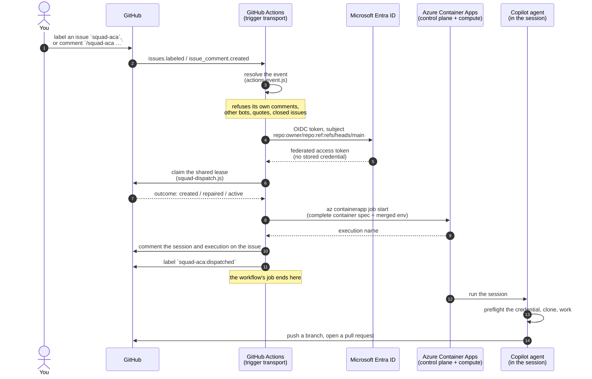

# Triggering a session from a GitHub event

Squad on ACA can start a session from a GitHub issue event. A GitHub Actions workflow authenticates to Azure by OIDC, claims the shared dispatch lease, and starts the ACA session job.

Actions is the trigger transport. The shared dispatch core in `worker/lib/` decides whether to run, claims the lease, and starts the same ACA session job used by the local CLI, Ralph, and Watch.

## End-to-end path



| Stage | Runs on | Holds |
|---|---|---|
| Decide whether the event is a trigger | GitHub Actions runner | Event payload |
| Federate to Azure | GitHub Actions runner | Short-lived OIDC token |
| Claim the lease | GitHub Actions runner | `GITHUB_TOKEN`, scoped to this repository |
| Decide the route, run the agent, push | Azure Container Apps | The session credential, delivered as an ACA secret |

The workflow starts a job and exits. It does not wait for the session, poll it, or hold the session credential.

## Triggers

| Trigger | What happens |
|---|---|
| Apply the **`squad-aca`** label to an open issue | A session is dispatched to work that issue |
| Comment **`/squad-aca <instruction>`** on an open issue | A session is dispatched with your instruction as the prompt |
| Comment **`@squad-on-aca-control-plane <instruction>`** | A session is dispatched with your instruction as the prompt |
| Comment **`/squad-aca`** with no text | A session is dispatched with a default prompt |
| Run the workflow manually | `workflow_dispatch`, with optional issue and prompt inputs |

The label and command prefix are configurable through repository variables `SQUAD_TRIGGER_LABEL` and `SQUAD_COMMAND_PREFIX`.

Use `squad-aca` as the default label. Keep Ralph's `RALPH_LABELS` aligned with `SQUAD_TRIGGER_LABEL` so all dispatchers use the same lease key and marker label.

## Who may trigger a run

Every route into Squad on ACA is gated. A run costs money and executes an agent
with a token that can write to the repository, so nothing dispatches for someone
who has not been given access to that repository.

| Route | Who can use it | Enforced by |
|---|---|---|
| Apply the `squad-aca` label | Collaborators with **Triage** or above | GitHub — the label control is not shown to anyone else |
| Comment `/squad-aca <instruction>` | **Owner, organisation member, or collaborator** | Squad on ACA, from `author_association` |
| Comment `@squad-on-aca-control-plane <instruction>` | Same as above | Same as above |
| Run the workflow manually | Collaborators with **Write** or above | GitHub — `workflow_dispatch` requires write |
| Ralph's five-minute poll | Picks up issues that already carry the label | Whoever applied the label, above |

A command comment from anyone else is refused with `actor-may-not-dispatch`. An
ordinary comment that carries no command is ignored, not refused, so people can
talk on an issue without filling the log with alarms.

### Granting someone access

**Settings → Collaborators and teams → Add people.** That is the whole
mechanism. From then on they can comment `/squad-aca …` and it runs in your
Azure subscription.

Any role works, **including Read**. Choose the role by what else you want them
to do:

| Role | Can comment the command | Can apply the label | Can push |
|---|---|---|---|
| Read | yes | no | no |
| Triage | yes | yes | no |
| Write | yes | yes | yes |

Removing them from the repository removes their access to dispatch, the same
minute.

### `CONTRIBUTOR` is not a permission

GitHub reports `CONTRIBUTOR` for anyone who has ever had a commit merged here.
On a public repository that is anybody who once landed a pull request, and they
have **no access to anything**. Sampled live on a large public repository,
`CONTRIBUTOR` accounted for 29 of 100 comments.

So `CONTRIBUTOR` is deliberately **not** permitted, and there is no such thing as
"adding someone as a contributor". The thing you add is a **collaborator**, and
GitHub reports those as `COLLABORATOR`.

| `author_association` | Means | May dispatch |
|---|---|---|
| `OWNER` | Owns the repository | **yes** |
| `MEMBER` | In the organisation that owns it | **yes** |
| `COLLABORATOR` | You invited them to the repository | **yes** |
| `CONTRIBUTOR` | Has had a commit merged. No access. | no |
| `FIRST_TIME_CONTRIBUTOR`, `FIRST_TIMER` | Has not committed here before | no |
| `MANNEQUIN` | Placeholder for an unclaimed user | no |
| `NONE` | No relationship to the repository | no |

`author_association` is set by GitHub on the comment. A commenter cannot change
it.

### Why this is needed

`issue_comment` workflows run from the repository's **default branch, with
access to repository secrets**. On a public repository, without this check, any
GitHub account could comment the command and start a job in your subscription,
on your bill, running an agent with a token that can write to your repository.

## Issue response

The trigger comments on the issue with:

- the session name;
- the ACA execution name;
- a link to the workflow run.

Commits carry a `Co-authored-by:` trailer naming the requester. The session keeps a machine author and credits the requester with the trailer.

## Refusals

Each refusal has a named reason in the workflow log and is covered by `worker/tests/test_actions_event.sh`.

| Situation | Reason |
|---|---|
| The App itself comments or labels | `actor-is-this-app` |
| Any other bot issues the command | `actor-is-a-bot` |
| The command appears in a quoted reply (`> /squad-aca ...`) | `comment-carries-no-command` |
| The App is mentioned mid-sentence (`I think @squad-... could help`) | `comment-carries-no-command` |
| The command appears mid-sentence | `comment-carries-no-command` |
| A comment is edited to contain the command | `action-not-a-trigger` |
| The issue is closed | `issue-is-closed` |
| A different label is applied | `label-not-the-trigger-label` |
| An issue is merely opened | `action-not-a-trigger` |

The App's own comments are refused before dispatch so status comments do not start another session.

## Duplicate dispatch

Ralph and Actions can see the same issue. Two mechanisms prevent duplicate sessions:

| Window | Mechanism |
|---|---|
| Concurrent dispatch | The shared lease. The workflow runs `squad-dispatch.js decide --dispatch-source actions` and claims the lease before requesting compute. Losing the race stands the trigger down. |
| Sequential dispatch | The `squad-aca:dispatched` label is applied only after a confirmed start. |

`actions` is a first-class value in `DISPATCH_SOURCES`.

## Required container start shape

`az containerapp job start` must receive a complete container spec when per-execution `--env-vars` are supplied:

- name;
- image;
- CPU;
- memory;
- merged environment values, including `secretref:` entries.

The workflow uses Ralph's `ralph_build_session_env` so the template values and overrides are merged before the start call.

Sessions are dispatched as `SQUAD_MODE=prompt`. Valid worker modes are `smoke`, `telemetry-smoke`, `prompt`, `new-project`, `loop`, `ralph`, `watch`/`triage`, and `shell`. Anything else exits `64`.

## Setup

The workflow needs three repository secrets and a federated credential.

1. Create a user-assigned managed identity and give it a federated credential for the default branch subject.

```bash
az identity create -n uai-squad-aca-gha -g <rg> -l <region>
az identity federated-credential create --name gha-main \
  --identity-name uai-squad-aca-gha -g <rg> \
  --issuer https://token.actions.githubusercontent.com \
  --subject "repo:<owner>/<repo>:ref:refs/heads/main" \
  --audiences api://AzureADTokenExchange
```

2. Grant it `Container Apps Jobs Operator`, scoped to the session job.

```bash
az role assignment create --assignee-object-id <principalId> \
  --assignee-principal-type ServicePrincipal \
  --role "Container Apps Jobs Operator" \
  --scope ".../Microsoft.App/jobs/<session-job>"
```

3. Set repository secrets:

```text
AZURE_CLIENT_ID
AZURE_TENANT_ID
AZURE_SUBSCRIPTION_ID
```

There is no client secret.

## Workflow permissions

Permissions default to nothing at the workflow level. Each job requests only what it uses.

| Job | Permission | Use |
|---|---|---|
| `resolve` | `contents: read` | Checkout and event resolution |
| `dispatch` | `id-token: write` | OIDC federation to Azure |
| `dispatch` | `contents: write` | Durable lease writes |
| `dispatch` | `issues: write` | Apply the shared `squad-aca:dispatched` marker and comments |

Verify the grant by attempting to read a different job with the same identity. It must be refused.

## Default branch protection

`Contents: write` on a GitHub App is repository-wide. Constrain the default branch with a ruleset whose bypass list excludes the App.

Expected refusal:

```text
remote: - Changes must be made through a pull request.
 ! [remote rejected] main -> main (push declined due to repository rule violations)
```

A ruleset refusal exits `1`. A rejected credential exits `128`. The worker classifies them separately.

## Operation

### Redeploy after image changes

`deploy.ps1` recreates the session job when the image changes. Role assignments scoped to that job are recreated during deploy. Pass `-GitHubActionsIdentityName` when the identity is not `uai-<prefix>-gha`.

A deployment with no such identity skips the trigger grant because the Actions trigger is optional.

### Run the same issue again

Leases are keyed by issue. To run the same issue again after a completed session, release its lease first:

```bash
node worker/lib/squad-dispatch.js release --repository <owner>/<repo> \
  --lease-key issue-<n> --session-id <session>
```

### Stale leases

`squad-lease-sweep.yml` runs hourly and calls `squad-dispatch.js sweep`.

Release one by hand:

```bash
node worker/lib/squad-dispatch.js list --repository <owner>/<repo>
node worker/lib/squad-dispatch.js release --repository <owner>/<repo> \
  --lease-key issue-<n> --session-id <session>
```

### Rate limits

Installation tokens get 5,000 requests/hour. Secondary content limits are 80 content-creation requests per minute and 500 per hour. The sweep prints the remaining core budget each run.

### Cost

| Component | Cost |
|---|---|
| GitHub Actions minutes | Free on public repositories, metered on private ones. Each dispatch uses roughly a minute of runner time. |
| ACA session job | Same execution the local CLI and Ralph start. |
| The hourly sweep | About 10 seconds of runner time per run. |

The trigger does not hold a runner while the session runs.

### Incremental pushes

`squad_push_checkpoint` pushes work at safe boundaries.

It is off by default. Set `SQUAD_INCREMENTAL_PUSH=true` to enable it for sessions that have safe boundaries.
